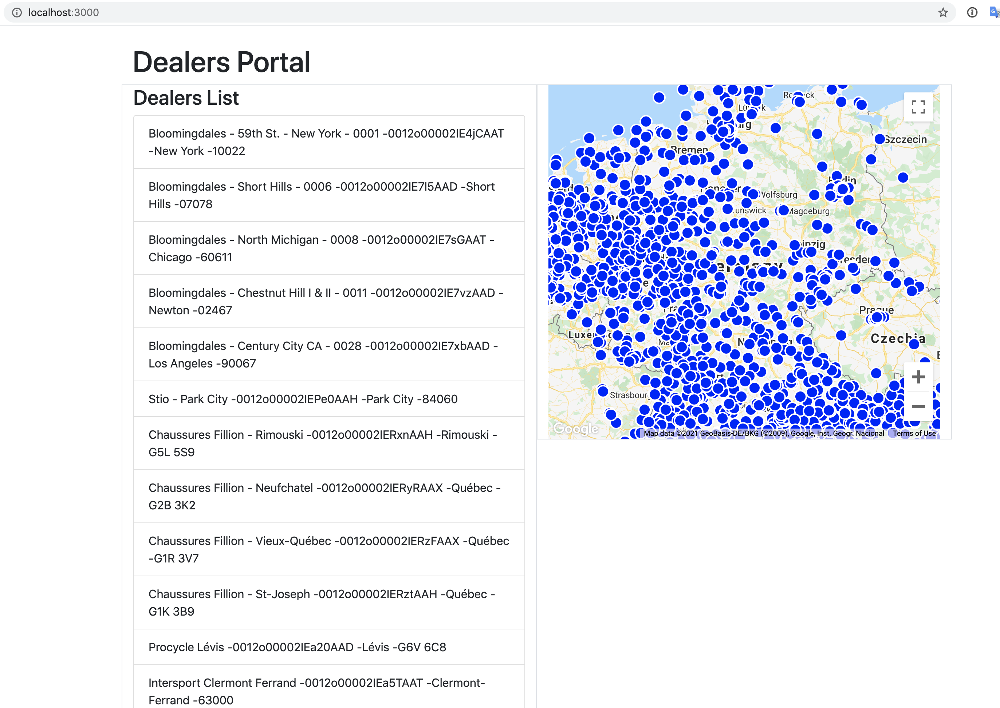

## Salesforce Dealer Portal

The objective of this project is to develop a web application which we will display all the locally synced dealers from salesforce account.

We are using Salesforce API to fetch the accounts who has E_Shop_Dealer_C = 'Dealer and Point of Sale'.

We also sync local data with remote data, which includes:
- Create new dealers locally if received new dealers from API
- Delete local dealers if local deaer is missing in API response
- Update local dealer data if remote dealer data got changed 

##Approach

# Backend
Using rake task to perform the sync. We can schedule a sidekiq job to run in a specific interval to run this sync as well. But I have not covered this with app.
We perform sync in following steps:
- Fetch all the dealers by using Salesforce API with specific query
- Prepare a hash with following format for each records in it:  
```
{
    salesforce_account_id => Restforce::SObject of account data
}
```
- Fetch local dealers account_ids and prepare the list of accounts which we need to create, delete or pass for update.
- Create local dealer records for all the new dealers found in above step
- Delete local dealer records if not present in remote dealers data
- Check if any existing dealer data got changed, if yes then make update for local record from remote record

Frontend
- Use react js to build an index page with dealer list and map
- Create marker on map for each dealer location by using latitude and longitude


## Pending requirements
- On click of market highlight list item and vice versa at frontend page
- Secure map key in frontend

## System dependencies
* Ruby version: ruby-2.6.6
* Rails version: 6.0.3
* React JS: 17.0.1
* PostgreSQL

## Important Gems and Packages Used
* Restforce is a ruby gem for the Salesforce REST api
* RSpec for testing
* google-map-react react package to render Google map

## Setup

Make sure you have [Ruby](https://www.ruby-lang.org) and [Bundler](http://bundler.io)

```sh
git clone git@github.com:sandeep-patle1508/salesforce-dealers-portal.git
cd salesforce-dealers-portal
bundle install
yarn install
rails db:create
rails db:migrate
```

Configure config/credentials.yml.enc to setup Salesforce API credentials
```sh
EDITOR=vi bin/rails credentials:edit
```

## How to run the test suite:
```sh
bundle exec rspec
```

## Sync dealer data from remote Salesforce account
```sh
bundle exec rake salesforce:sync_dealers
```

## Run in local
```sh
rails s
```
Visit http://localhost:3000


